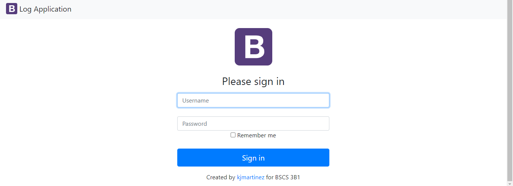

# **LogApp**
This markdown file provides the step-by-step guide in doing LogApp. This is a web-based application that help log the one's personal information as well as the date and time of their visit in a place, just like a normal logbook. 

---

## 💡**Tasks**
The purpose of this markdown should be attained by the ff:

- Install necessary softwares to do the task
- Modify the code to localhost 
- Navigate to the LogApp
---
## ❓**What essential softwares are needed?**
1. VS Code 
2. Github account
3. WampServer or Xampp that has phpMyAdmin for Database Administration 
---
## 🔗**Necessary Links and Installers**

Wamp Server https://sourceforge.net/projects/wampserver/           Create your Github Account https://github.com/

---
## 💻**Installation**

📢Prepare the installed softwares such as WampServer that runs phpMyAdmin and MySQL for database management.

✨Provided below are the steps in activating the WampServer

 
📢Database creation using **phpMyAdmin**
- Login to phpMyAdmin
- Create database
- Import database/ SQL file

>Fill the necessary text fields to navigate your database

📢Clone the repository link to your local machine  
To access the repository in **Github** click the link provided below:

Repository link https://github.com/kowwwwwb/logApp-Velasco.git

 &nbsp; &nbsp;👌 Always clone it in a path where you can easily access (e.g Desktop)

📢Copy the folder from cloned repository to the directory C:\wamp64\www then paste.
- Run the Wampserver
- Open it to a browser and put localhost in the URL 

---
## 👨‍💻**Navigate to LogApp**

>**Guest Log Form**  

Shall be redirected to Login page after filling in the text fields.

 

>**Admin Log**

Shall be redirected to Guest List page after Signing in.

 

>**Guest Book List**

Must show the information added as well as the existing data inside the list.

---
## 🖱️**Authors**

 🧑‍💻**Carl Kobe Velasco**

 👩‍💻**Shaira Gay Pascua**

 👨‍💻**Adrian Dave Convocar**

